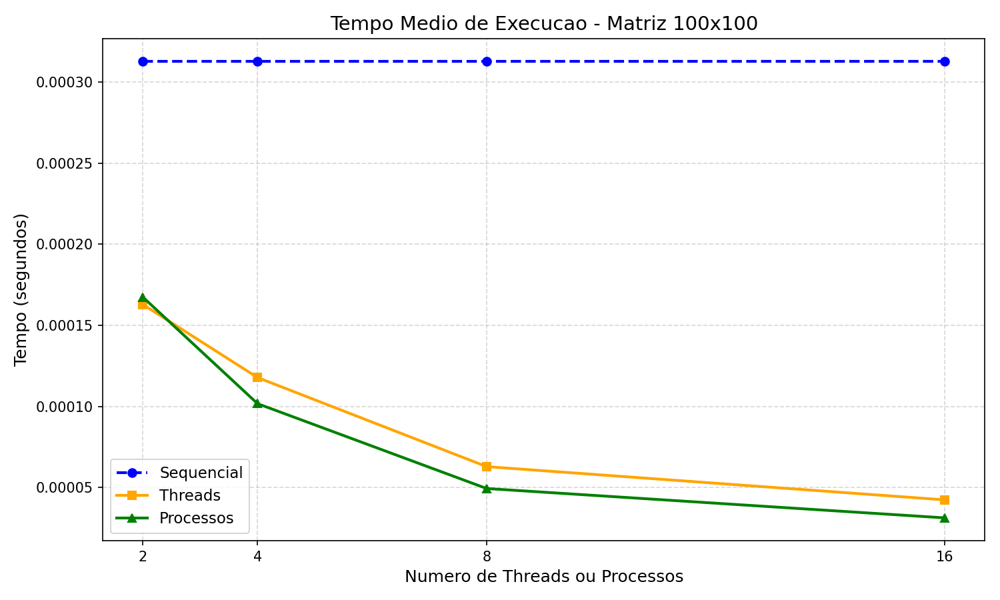
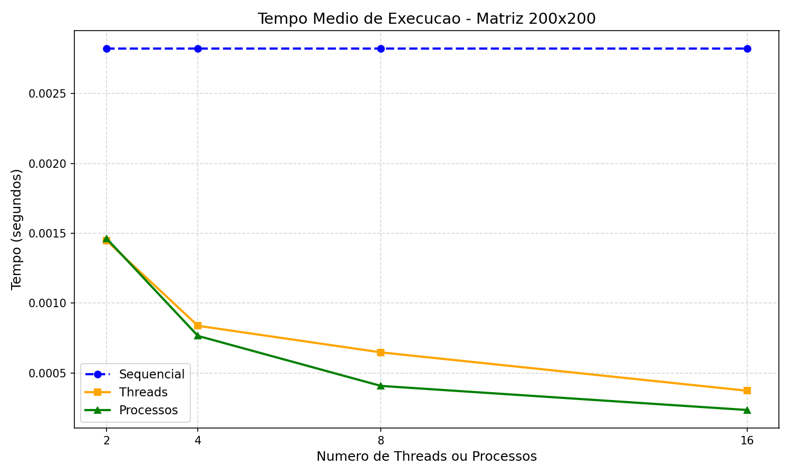
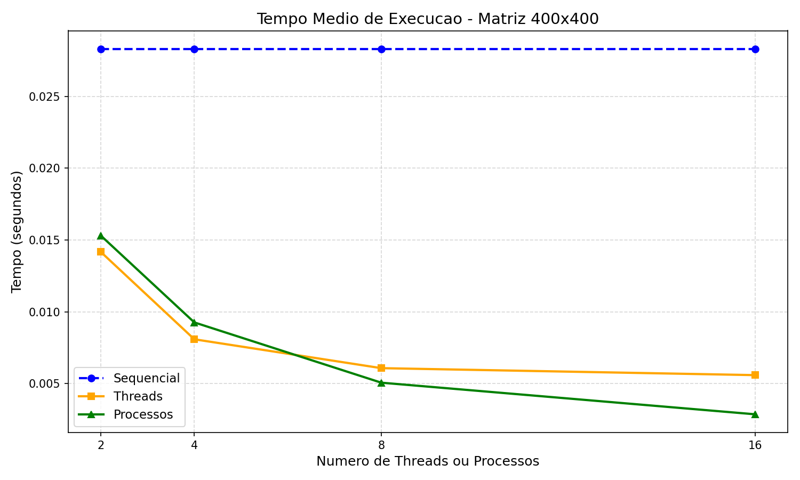
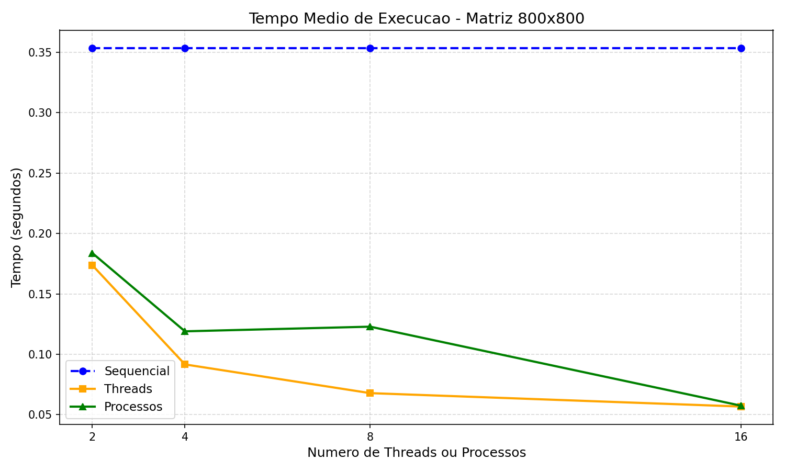

# Trabalho Prático 1 — Processos e Threads

<div align="center">


**IMD0036 – Sistemas Operacionais · 2026**  
Gabriel Afonso Freitas Aires · `20240078874` · Engenharia de Computação / CT – Natal

---

### Entregáveis

[](https://drive.google.com/file/d/10BmLQy7w-xvNjNxLY3hCw8018NqeaYLq/view?usp=drive_link)
[](docs/relatorio.pdf)
[](docs/relatorio.html)
[](docs/slides_apresentacao.pdf)

</div>

---

## Sobre o projeto

Implementação e análise comparativa da **multiplicação de matrizes** usando três abordagens:

| Abordagem | Arquivo | Estratégia |
|-----------|---------|------------|
| Sequencial | `src/sequencial.cpp` | Algoritmo clássico O(n³) — baseline |
| Paralela com Threads | `src/paralelo_threads.cpp` | T pthreads POSIX, cada uma computa N/T linhas |
| Paralela com Processos | `src/paralelo_processos.cpp` | P processos via `fork()`, cada um computa N/P linhas |

A multiplicação de matrizes é um problema com **Independência dos Dados** — cada elemento `c_ij` pode ser calculado de forma completamente independente, tornando o problema ideal para paralelização.

---

## Estrutura do repositório

```
trabalho1/
├── src/                        # Código-fonte C++
│   ├── auxiliar.cpp            # Gerador de matrizes aleatórias
│   ├── sequencial.cpp          # Multiplicação sequencial (baseline)
│   ├── paralelo_threads.cpp    # Multiplicação com T pthreads
│   └── paralelo_processos.cpp  # Multiplicação com P processos (fork)
│
├── scripts/                    # Scripts de build e automação
│   ├── Makefile                # Compilação via make
│   ├── compilar.sh             # Compila todos os programas
│   └── executar_testes.sh      # Roda Etapa 2 completa (Linux)
│
├── analysis/                   # Análise de dados e visualização
│   ├── resultados.csv          # Dados coletados (10 runs × 9 configs × 4 tamanhos)
│   ├── gerar_graficos.py       # Gráficos de tempo médio por tamanho
│   ├── gerar_relatorio.py      # Relatório HTML completo
│   └── gerar_slides_v2.py      # Slides da apresentação (PDF)
│
├── docs/                       # Documentação e entregáveis
│   ├── relatorio.pdf           # Relatório completo (PDF, 10 páginas)
│   ├── relatorio.html          # Relatório completo (HTML interativo)
│   ├── slides_apresentacao.pdf # Slides do vídeo (10 slides)
│   ├── roteiro.txt             # Roteiro do vídeo (3 min)
│   └── graficos/               # Gráficos exportados (PNG)
│
├── examples/                   # Exemplos de arquivos de entrada/saída
│   ├── matrix1_sample.txt      # Exemplo de matriz de entrada
│   ├── resultado_sequencial_sample.txt
│   ├── resultado_thread_sample.txt
│   └── resultado_processo_sample.txt
│
├── .gitignore
└── README.md
```

---

## Como compilar e executar

### Pré-requisitos

- `g++` com suporte a C++11
- `pthread` (POSIX Threads)
- Linux, macOS ou MSYS2 (Windows)

### Compilação

```bash
cd scripts

# via Make
make -f Makefile

# ou via script
chmod +x compilar.sh
./compilar.sh
```

Os binários são gerados em `src/`.

### Execução

#### 1. Gerar matrizes

```bash
# Gera matrix1.txt (100×100) e matrix2.txt (100×100)
./src/auxiliar 100 100 100 100
```

#### 2. Multiplicação sequencial

```bash
./src/sequencial matrix1.txt matrix2.txt resultado_seq.txt
# Saída: resultado_seq.txt com resultado + tempo em microssegundos
```

#### 3. Multiplicação paralela — Threads

```bash
# T = número de threads (ex: 4)
./src/paralelo_threads matrix1.txt matrix2.txt resultado_thr 4
# Gera: resultado_thr_thread0.txt ... resultado_thr_thread3.txt
```

#### 4. Multiplicação paralela — Processos

```bash
# P = número de processos (ex: 4)
./src/paralelo_processos matrix1.txt matrix2.txt resultado_proc 4
# Gera: resultado_proc_processo0.txt ... resultado_proc_processo3.txt
```

### Rodar todos os testes (Etapa 2)

```bash
chmod +x scripts/executar_testes.sh
cd src && ../scripts/executar_testes.sh
# Gera analysis/resultados.csv com médias de 10 execuções
```

---

## Formato dos arquivos

### Entrada (`matrix1.txt`)

```
100 100
23.45 17.80 91.12 ...
...
```

Primeira linha: dimensões `N M`. As linhas seguintes contêm os valores da matriz.

### Saída (`resultado_seq.txt`)

```
100 100
c11 254.32
c12 198.10
...
c100100 312.45
327
```

Primeira linha: dimensões do resultado. Elementos no formato `cIJ valor`. Última linha: tempo de execução em **microssegundos**.

---

## Resultados

Experimentos realizados com matrizes quadradas de 100×100 até 800×800, **10 execuções** por configuração. O tempo considerado para as versões paralelas é o do *worker* mais lento (gargalo real do sistema).

### Tempo médio — Matriz 800×800

| Configuração | Tempo médio | Speedup |
|---|---|---|
| Sequencial | 354 ms | 1,0× |
| Threads T=2 | 174 ms | 2,0× |
| Threads T=4 | 92 ms | 3,9× |
| Threads T=8 | 68 ms | 5,2× |
| **Threads T=16** | **57 ms** | **6,2×** |
| Processos P=2 | 184 ms | 1,9× |
| Processos P=4 | 119 ms | 3,0× |
| Processos P=8 | 123 ms | 2,9× |
| Processos P=16 | 57 ms | 6,1× |

> Redução de **84%** no tempo de execução com 16 threads para matrizes 800×800.

### Gráficos

<div align="center">

| 100×100 | 200×200 |
|---------|---------|
|  |  |

| 400×400 | 800×800 |
|---------|---------|
|  |  |

</div>

---

## Discussão

### Por que o speedup nunca é linear?

A **Lei de Amdahl** estabelece que toda aplicação contém uma fração serial irredutível — leitura de arquivos, criação de *workers*, escrita dos resultados — que limita o ganho máximo independente do número de *workers*. Com 16 threads o speedup atingiu 6,2× em vez do ideal de 16×.

### Threads vs. Processos

| | Threads | Processos |
|---|---|---|
| **Memória** | Compartilhada (M1 e M2 lidas 1×) | Isolada (`fork()` + copy-on-write) |
| **Overhead de criação** | ~µs (`pthread_create`) | ~ms (`fork()`, PCB, descritores) |
| **Sincronização** | Desnecessária (faixas distintas) | Desnecessária (processos isolados) |
| **Cache L1/L2** | Compartilhado | Exclusivo por processo |
| **Melhor caso** | Matrizes de qualquer tamanho | Matrizes muito grandes |

### Valor ideal de T e P

- **Threads:** `T = 8` — melhor equilíbrio speedup/eficiência (~65%). T=16 traz ganho marginal com eficiência ~44%.
- **Processos:** `P = 8` — overhead do `fork()` corrói eficiência em P alto.
- **Regra geral:** `T = P ≈ número de núcleos físicos da CPU`.

---

## Gerar relatório e slides

```bash
cd analysis

# Gráficos PNG
python3 gerar_graficos.py

# Relatório HTML + PDF
python3 gerar_relatorio.py   # → docs/relatorio.html
python3 gerar_pdf.py          # → docs/relatorio.pdf

# Slides da apresentação
python3 gerar_slides_v2.py    # → docs/slides_apresentacao.pdf
```

Requer: `matplotlib`, `numpy` (`pip install matplotlib numpy`)

---

## Entregáveis

| Arquivo | Formato | Descrição |
|---------|---------|-----------|
| [relatorio.pdf](docs/relatorio.pdf) | PDF | Relatório completo — 10 páginas A4 |
| [relatorio.html](docs/relatorio.html) | HTML | Relatório interativo com gráficos embutidos |
| [slides_apresentacao.pdf](docs/slides_apresentacao.pdf) | PDF | 10 slides da apresentação em vídeo |
| [roteiro.txt](docs/roteiro.txt) | TXT | Roteiro narrado do vídeo (≤3 min) |
| [Vídeo de Apresentação](https://drive.google.com/file/d/10BmLQy7w-xvNjNxLY3hCw8018NqeaYLq/view?usp=drive_link) | Google Drive | Apresentação em vídeo do trabalho |

---

## Autor

**Gabriel Afonso Freitas Aires**  
Matrícula: `20240078874`  
Curso: Engenharia de Computação / CT – Natal – Bacharelado  
UFRN · Instituto Metrópole Digital  

[](https://github.com/GabrielAirex)

---

<div align="center">
<sub>IMD0036 – Sistemas Operacionais · Trabalho Prático Unidade 1 · 2026</sub>
</div>
